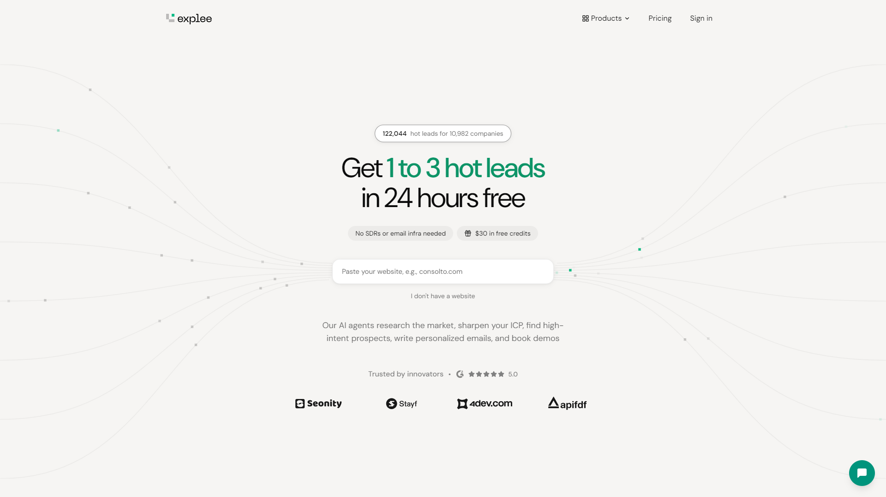

# Explee Landing Page Clone

A faithful, high-fidelity reproduction of the **[Explee](https://explee.com)** landing page built with modern React 18, Vite 6, and Tailwind CSS.



---

## ✨ Features & Visual Accuracy

- **Organic Particle Flow Streams (`FlowCanvas.jsx`)**:
  - Exact 8-path cubic Bezier curves with 64-step Look-Up Table (LUT) arc-length parameterization for uniform dot velocities.
  - Emerald green (`#10b981`) and subtle gray floating particles flanking the hero input and cascading vertically down the CTA section.
- **Deck-of-Cards Sticky Stacking (`PipelineSection.jsx`)**:
  - Smooth native sticky stacking mechanism where all 6 pipeline stages progressively overlap with exact 15px vertical step offsets.
  - Interactive competitor analysis with rotating favicons, fit score tables, prospect identity plaques, email preview, and campaign metric scaling.
- **Dynamic Pay-as-You-Go Calculator (`CalculatorSection.jsx`)**:
  - Interactive budget range slider ($0–$100, default $30) computing live email volume ($0.03/email), warm leads range, and meetings.
  - Floating price bubble dynamically aligned above the slider thumb with `clamp()` math.
- **Animated Headline Transitions (`BottomCtaSection.jsx`)**:
  - Staggered word blur-and-slide transitions between *"You’ve heard it all before"* and *"This one really works"*.
- **Testimonials & Logos Carousel**:
  - 3-row infinite looping testimonial marquee with hover-pause on desktop, and snap-scrolling on mobile.
  - Brand and VC logos carousel with G2 5.0 rating badge.
- **Responsive Navigation & Mobile Drawer**:
  - Sticky backdrop-blurred navbar with Products dropdown and mobile slide-out drawer.
  - Floating emerald support chat widget with interactive modal dialog.

---

## 🚀 Quick Start

### 1. Install Dependencies

```bash
npm install
```

### 2. Development Server

Start the local development server at `http://localhost:3000`:

```bash
npm run dev
```

### 3. Production Build

Build optimized static assets to `dist/`:

```bash
npm run build
npm run preview
```

---

## 🛠 Tech Stack

- **Framework**: [React 18](https://react.dev/)
- **Build Tool**: [Vite 6](https://vitejs.dev/)
- **Styling**: [Tailwind CSS](https://tailwindcss.com/)
- **Icons**: [Lucide React](https://lucide.dev/)
- **Testing & Validation**: [Playwright](https://playwright.dev/)

---

## 🧪 Testing & Validation

The codebase includes automated Playwright test scripts in `scripts/`:

```bash
# Run interaction test suite (slider, hero input, modal, FAQ accordion, mobile nav)
python scripts/test_interactions.py

# Generate full-page & section-by-section validation screenshots
python scripts/capture_validation.py
```
